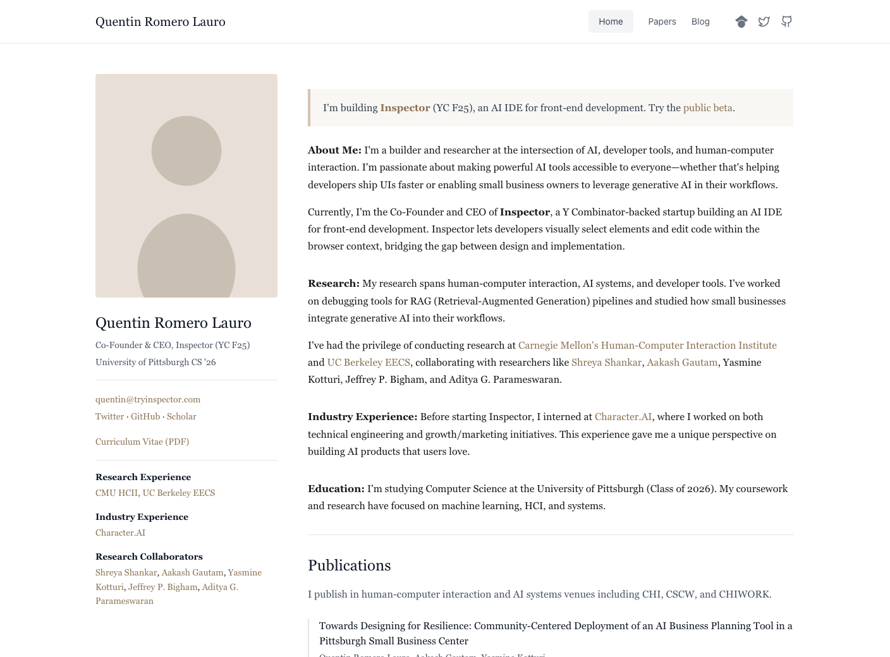

#  Academic Personal Website Template

A clean, modern academic personal website template built with Next.js 14, React, and Tailwind CSS. Perfect for researchers, PhD students, professors, and academics who want a professional online presence.



## Features

- **Clean, Professional Design**: Minimalist academic aesthetic with focus on readability
- **Responsive Layout**: Works great on desktop and mobile devices
- **Easy to Customize**: Simple component-based architecture
- **Fast Performance**: Built with Next.js for optimal loading times
- **SEO Friendly**: Server-side rendered pages with proper meta tags
- **Publications Support**: Organized by year with co-author notation support

## Pages

- **Home**: Main profile page with sidebar (photo, contact info, collaborators) and main content (about, research, publications)
- **Papers**: Organized publications list by year
- **Blog**: Simple blog listing page

## Getting Started

### Prerequisites

- Node.js 18+ 
- npm, yarn, or pnpm

### Installation

1. Clone or copy this directory
2. Install dependencies:

```bash
npm install
# or
yarn install
# or
pnpm install
```

3. Run the development server:

```bash
npm run dev
# or
yarn dev
# or
pnpm dev
```

4. Open [http://localhost:3000](http://localhost:3000) in your browser

## Customization

### Profile Information

Edit the following files to customize your profile:

- `src/components/Sidebar.tsx` - Your name, title, email, affiliations, collaborators
- `src/components/MainContent.tsx` - About section, research, education, publications
- `src/components/Header.tsx` - Navigation and social links
- `src/app/layout.tsx` - Page title and meta description

### Adding Your Photo

Replace `public/profile.png` with your own profile photo.
Recommended dimensions: Square or near-square (e.g., 260x260 or 300x300 pixels).

### Publications

Edit the publications in:
- `src/components/MainContent.tsx` - Featured publications on homepage
- `src/app/papers/page.tsx` - Full publications list

Publications support:
- Co-first author notation (e.g., `Author1*, Author2*` with a note)
- "To appear" venues
- Multiple link types (Paper, Code, Demo, etc.)

### Blog Posts

Edit blog posts in `src/app/blog/page.tsx`. For a full blog with individual post pages, you can extend this with:
- MDX for markdown-based posts
- A CMS like Contentful or Sanity
- Static markdown files

## Project Structure

```
academic-template/
├── public/
│   └── profile.png         # Your profile photo
├── src/
│   ├── app/
│   │   ├── globals.css     # Global styles
│   │   ├── layout.tsx      # Root layout with metadata
│   │   ├── page.tsx        # Home page
│   │   ├── papers/
│   │   │   └── page.tsx    # Papers page
│   │   └── blog/
│   │       └── page.tsx    # Blog page
│   └── components/
│       ├── Header.tsx      # Navigation header
│       ├── Sidebar.tsx     # Profile sidebar
│       └── MainContent.tsx # Main content area
├── package.json
├── tailwind.config.ts
└── tsconfig.json
```

## Styling

The template uses:
- **Tailwind CSS** for utility-first styling
- **Georgia/serif fonts** for a classic academic feel
- **Warm brown accent colors** for links (`#8B7355`)

To customize colors, edit `tailwind.config.ts` and `src/app/globals.css`.

## Deployment

### Vercel (Recommended)

1. Push to GitHub
2. Import to [Vercel](https://vercel.com)
3. Deploy

### Netlify

1. Push to GitHub
2. Import to [Netlify](https://netlify.com)
3. Set build command: `npm run build`
4. Set publish directory: `.next`

### Other Platforms

Build the site:

```bash
npm run build
```

The output will be in the `.next/` directory.

## License

MIT License - feel free to use this template for your personal website!

---

Built with Inspector. Learn more at [tryinspector.com](https://tryinspector.com)
